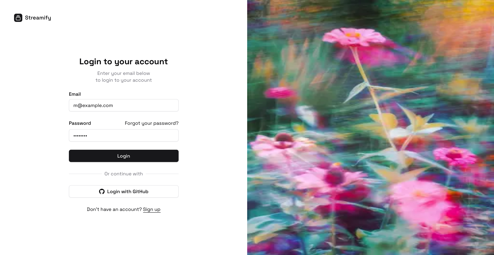
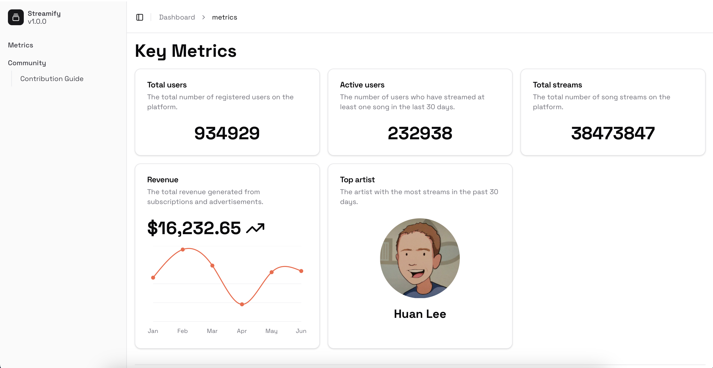

# Streamify

A frontend application that displays an analytics dashboard for a fictional music streaming service called "Streamify." The dashboard should present key metrics and data visualizations, allowing the service's management team to gain insights into user activity, revenue, and content performance. The goal is to build a functional and visually appealing dashboard that is both responsive and user-friendly.

## Preview

<div align="center">
  
  <p><em>Login page</em></p>
</div>

<div align="center">
  
  <p><em>Metrics page</em></p>
</div>

## Tech Stack

- Next a react framework
- Typescript for types
- Shadcn for ui components
- Jest for testing

## Getting Started

First, run the development server:

```bash
npm run dev
# or
yarn dev
# or
pnpm dev
# or
bun dev
```

Open [http://localhost:3000](http://localhost:3000) with your browser to see the result.
̌
